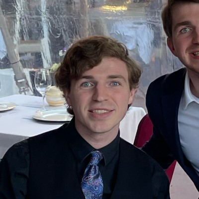

# Welcome to my webpage, my name is Nicholas (Nico) Tahernia.

#### I am a third year Mathematics - Computer Science student. 

About Me
----------------------

I have previously worked for [Daybreak Game Company](https://www.daybreakgames.com/home) and [Perspecta](https://perspecta.com/) and now am an incoming ***software engineer intern*** for [Amazon](https://www.amazon.com/).

UCSD and CSE 110 Experience
----------------------

My favorite classes so far at UCSD have been:
1. *CSE 100*
2. *CSE 101*
3. CSE 130
4. CSE 105
5. ~~CSE 110~~ (hopefully!)
6. MATH 184
7. MATH 103B

Goals for the class:
- [X] Make first website.
- [ ] Find group.
- [ ] Establish project.
- [ ] Finish project.
- [ ] Have fun!

In the words of Thomas Powell:
> Everyone writes bad code.

- I hope to be able to improve my own codewriting skills this quarter.
- I also hope to learn more about the different JavaScript frameworks and the extent of what I can do with different `<var>` types. I've done a bit in the past but not really anything in depth. (i.e. I don't mean just `var x = 1;` or easily interpreted statements like that)

[README asociated with this project.](README.md)
[Screenshots associated with this project.](/screenshots)
